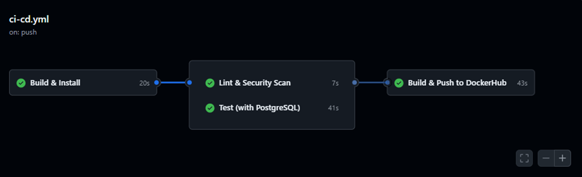

**DevOps Mid Exam**

**DevOps Documentation -- Flask + Celery Project**

**1. Technologies Used**

-   **Backend Framework:** Flask 2.3

-   **Task Queue:** Celery 5.3

-   **Message Broker & Result Backend:** Redis 6.2

-   **Database:** PostgreSQL 15

-   **ORM:** SQLAlchemy 3.1

-   **Email:** Flask-Mail

-   **Containerization:** Docker & Docker Compose

-   **CI/CD Platform:** GitHub Actions

-   **Code Quality Tools:** Flake8 (Linting), Bandit (Security Scan)

-   **Testing Framework:** Python unittest

-   **Environment Management:** .env files and GitHub Secrets

**2. Pipeline Design**

**CI/CD Workflow Overview**

**Trigger:** On any push or pull request → runs full CI pipeline\
**Jobs:**

1.  **Build & Install**: Sets up Python 3.9, installs dependencies.

2.  **Lint & Security Scan**: Flake8 for code style, Bandit for
    security.

3.  **Test (with Postgres)**: Runs unit & integration tests using an
    ephemeral Postgres service.

4.  **Docker Build & Push**: Builds Docker image and pushes to
    DockerHub.

5.  **Deploy (Main branch only)**: Deployment step triggered on main
    branch.

**Pipeline Flow Diagram (conceptual)**:

**3. Secret Management Strategy**

-   **Local development:** .env file (not committed to GitHub)

-   MAIL_USERNAME=youremail@gmail.com

-   MAIL_PASSWORD=yourpassword

-   **CI/CD (GitHub Actions):** GitHub Secrets

    -   DOCKERHUB_USERNAME

    -   DOCKERHUB_TOKEN

-   **Reasoning:** Keeps sensitive credentials **out of code
    repository**, ensures **secure injection into container
    environment**.

**4. Testing Process**

-   **Unit Testing:**

    -   Python unittest framework

    -   Tests include:

        -   Route accessibility (GET /)

        -   Database model correctness (EmailRecord)

-   **Database:**

    -   Uses **in-memory SQLite** for isolated tests
        (sqlite:///:memory:)

    -   For integration tests in CI: ephemeral **PostgreSQL container**
        via GitHub Actions services

-   **Linting & Security Scan:**

    -   Flake8 → Python code style

    -   Bandit → security vulnerabilities scanning

-   **CI Pipeline Integration:**

    -   All tests run automatically on every push or PR

    -   Pipeline fails if any critical test fails (except Bandit
        warnings, which can be non-blocking)

**5. Lessons Learned**

1.  **Environment Flexibility:**

    -   Using environment variables and .env files ensures code works
        across **local, CI/CD, and production** environments.

2.  **Asynchronous Task Handling:**

    -   Celery + Redis decouples long-running tasks from Flask, making
        the application more responsive.

3.  **Containerization:**

    -   Docker Compose simplifies **multi-container orchestration** for
        development and production.

4.  **CI/CD Integration:**

    -   GitHub Actions allows **automated testing, linting, building,
        and deployment**, reducing manual errors.

5.  **Secret Management:**

    -   Using GitHub Secrets and .env files prevents credentials from
        leaking into version control.

6.  **Testing Best Practices:**

    -   Isolated unit tests (SQLite) and integration tests (Postgres)
        ensure reliability without affecting production data.
